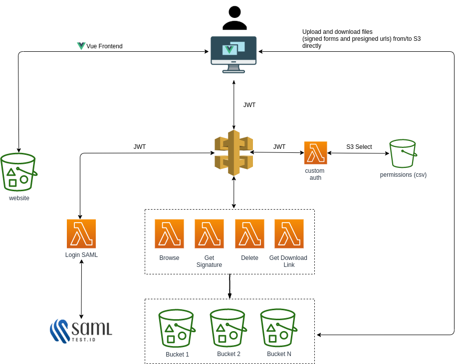
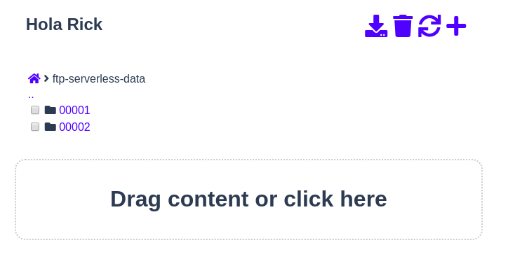
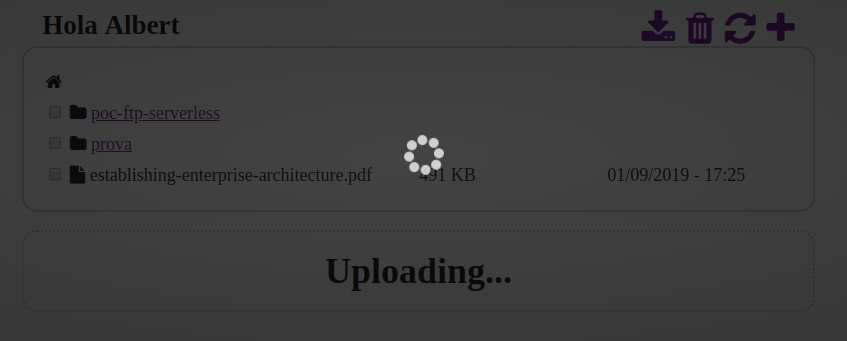

# PoC AWS FTP S3 Serverless

The goal of this project is to provide a space for users under AWS S3 buckets (shared S3 buckets with a "folder" for every user), with a web interface to upload, browse, download and remove files.

This PoC has been done between [asamo7](https://github.com/asamo7) and [davidayalas](https://github.com/davidayalas).

Features:

* It's possible to setup "users" and "admins". 

* A **user** adds its username (email from saml response) to each key (uploading, browsing, deleting...) . An **admin** can see everything under a bucket or a folder. See [permissions.csv](data/permissions.csv).
    - In our PoC, it works with SAML-JWT (https://samltest.id for demo purposes) deployed as a lambda (https://github.com/davidayalas/saml-jwt)
    - You need a Custom Authorizer for your API Gateway to validate JWT Token (sample here [backend/custom-auth/index.js](backend/custom-auth/index.js)). 
    - Our [custom authorizer](backend/custom-auth/index.js) queries with S3 Select the CSV and retrieves the permissions for a user and adds the buckets, folders and roles to the context. 

* A user can upload folders (drag and drop) and the structure is recreated in S3

* Files can be downloaded (not directories)

* Folders can be deleted (included not empty)

* A user can create a folder

## Architecture

 
 
## Deployment requirements

* Serverless framework: https://www.serverless.com/framework/docs/getting-started/
* Setup AWS credentials: https://www.serverless.com/framework/docs/providers/aws/cli-reference/config-credentials/
* Install all dependencies (give executable permissions to [install-dependencies.sh](install-dependencies.sh))

        $ sh ./install-dependencies.sh

* Update "serviceName" with your own in [setup.demo.json](https://github.com/davidayalas/aws-ftp-s3-serverless/blob/master/setup.demo.json#L2)

* Basic env variables:

    - SAML_CERT: you idp saml certificate as string
    - IDP_HOST: your idp
    - JWT_SECRET: to sign JWT from SAML and validate from custom authorizer

* Generate frontend distribution

        $ cd frontend
        $ npm run build

* Deploy demo

        $ sls deploy
        $ sls info | grep GET -m 1 | awk -F[/:] '{printf "const endpoint={get(){return '\''https://"$4"/demo/'\'';}};export default endpoint;"}' > frontend/src/assets/js/endpoint.js
        $ sls s3sync

* Update your [sp-metadata.xml](docs/sp-metadata.xml) with:
    * your issuer
    * your api gw endpoint
    * your api gw stage

* Upload this file to https://samltest.id/upload.php

* We've detected that sometimes we have to make a manual implementation (with no updates) cdof the API GW once implemented with serverless. 

## Sample interface




## Backend

1. [Upload](backend/form-signing-sts/index.js): this lambda generates the signature for valid uploads. 

1. [Browsing](backend/browsing/index.js): this lambda retrieves the objects in a path

1. [Delete](backend/delete-keys/index.js): this lambda deletes recursively all objects in a path

1. [Download](backend/get-presigned-urls/index.js): this lambda generate presigned urls for objects to be downloaded safely

1. [Login](backend/login/app.js): in this case SAML based to generate a JWT token.

    - Default setup points to samltest.id. [Metadata](/docs/sp-metadata.xml) for samltest.id is generated with [https://www.samltool.com/sp_metadata.php](https://www.samltool.com/sp_metadata.php):
    - In "Attribute Consume Service Endpoint (HTTP-POST)" you have to put your api endpoint:

            https://${api gateway id}.execute-api.${region}.amazonaws.com/${stage}/login/callback

    - In "entityID" update your issuer (same in environment variable for login handler in serverless.yml)

1. [Custom authorizer](backend/custom-auth/index.js): validates JWT token and adds extra permissions from [CSV](data/permissions.csv)

## Frontend

* New frontend is Vue based. Then follow the [Getting Started](https://v1.vuejs.org/guide/installation.html)

* Create file "frontend/src/assets/js/endpoint.js" with the following content replacing values with aproppiate

    ```javascript
    const endpoint={
        get(){
            return 'https://${your id}.execute-api.${your region}.amazonaws.com/${your stage}/';
        }
    };
        
    export default endpoint;
    ```

* Or you can generate it from sls info output:

        $  sls info | grep GET -m 1 | awk -F[/:] '{printf "const endpoint={get(){return '\''https://"$4"/demo/'\'';}};export default endpoint;"}' > frontend/src/assets/js/endpoint.js

# TODO

* Quotas
* Sharing
