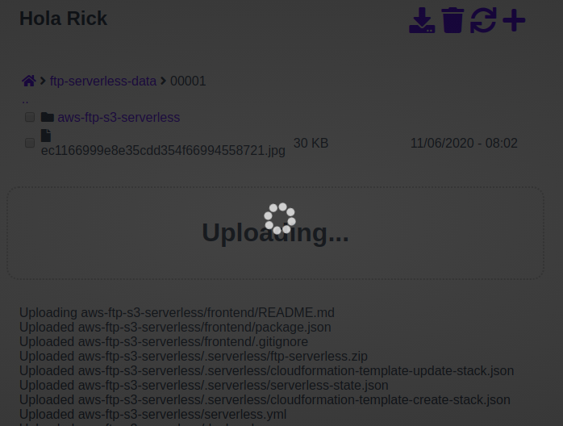

# PoC AWS FTP S3 Serverless

The goal of this project is to provide a space for users under a AWS S3 bucket (shared S3 bucket with a "folder" for every user), with a web interface to upload, browse, download and remove files.

This PoC is done between [asamo7](https://github.com/asamo7) and [davidayalas](https://github.com/davidayalas).

Features:

* Each user only sees its "folder" under S3 bucket. The folder is its "id" from OAuth or SAML
    - In our PoC, it works with SAML-JWT deployed as a lambda (https://github.com/davidayalas/saml-jwt)
    - You need a Custom Authorizer for your API Gateway to validate JWT Token (sample here [backend/custom-auth/index.js](backend/custom-auth/index.js)). Sample here: https://yos.io/2017/09/03/serverless-authentication-with-jwt/

* User can upload folders (drag and drop) and the structure is recreated in S3

* Files can be downloaded (not directories)

* Folders can be deleted (included not empty)

* Folder creation

## Deploy requirements

* Serverless framework: https://www.serverless.com/framework/docs/getting-started/
* Setup AWS credentials: https://www.serverless.com/framework/docs/providers/aws/cli-reference/config-credentials/
* Install "serverless-s3-sync" plugin

        $ npm install --save serverless-s3-sync

* Update "serviceName" with your own in [setup.demo.json](https://github.com/davidayalas/aws-ftp-s3-serverless/blob/master/setup.demo.json#L2)

* Basic env variables:

    - SAML_CERT: you idp saml certificate as string
    - IDP_HOST: your idp
    - JWT_SECRET: to sign JWT from SAML and validate from custom authorizer
    - AUTH_USERS: list of users with permissions (it will be a CSV queried with S3 Select)

* Deploy demo

        $ sls deploy
        $ sls info | grep GET -m 1 | awk -F[/:] '{printf "var endpoint='\''https://"$4"'\'';"}' > frontend/js/endpoint.js
        $ sls s3sync

## Sample interface




## Lambdas

1. Form signing for upload > [lambda/form-signing-sts/index.js](lambda/form-signing-sts/index.js) This lambda generates the signature for valid uploads. 

1. Browsing > [lambda/browsing/index.js](lambda/browsing/index.js) This lambda retrieves the objects in a path

1. Delete > [lambda/delete-keys/index.js](lambda/delete-keys/index.js) This lambda deletes recursively all objects in a path

1. Get presigned urls > [lambda/get-presigned-urls/index.js](lambda/get-presigned-urls/index.js) This lambda generate presigned urls for objects to be downloaded safely

1. Login: in this case SAML based to generate a JWT token.

## Setup interface

Create file "js/endpoint.js" with the following content replacing values with aproppiate. You can generate it from sls info output:

        $ sls info | grep GET -m 1 | awk -F[/:] '{printf "var endpoint='\''https://"$4"'\'';"}'

```javascript
var endpoint = "https://xxxxxxxx.execute-api.eu-west-1.amazonaws.com";
```

# TODO

* custom auth based on s3 select

* Quotas
* Sharing


